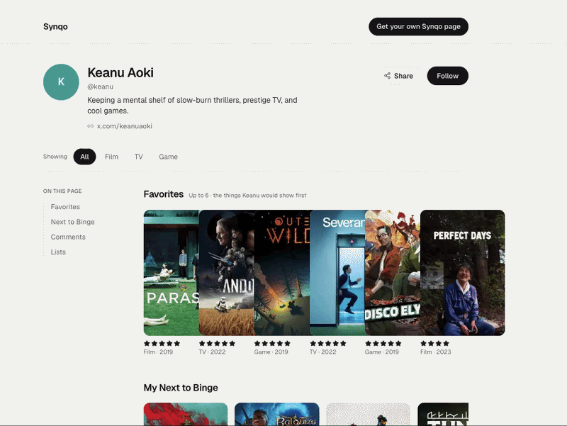

Synqo is a full-stack Next.js/Supabase app that lets users share their movie, TV, and game taste on a public profile.

This is a [Next.js](https://nextjs.org) project bootstrapped with [`create-next-app`](https://nextjs.org/docs/app/api-reference/cli/create-next-app).

## Video Walkthrough



## Run the development server

```bash
npm run dev
# or
yarn dev
# or
pnpm dev
# or
bun dev
```

Open [http://localhost:3000](http://localhost:3000) with your browser to see the result.
